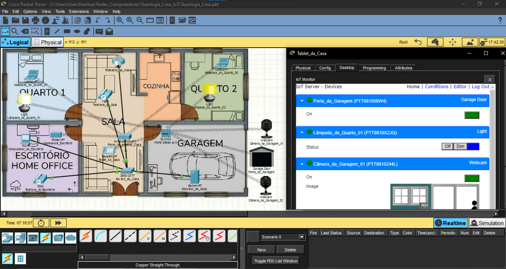
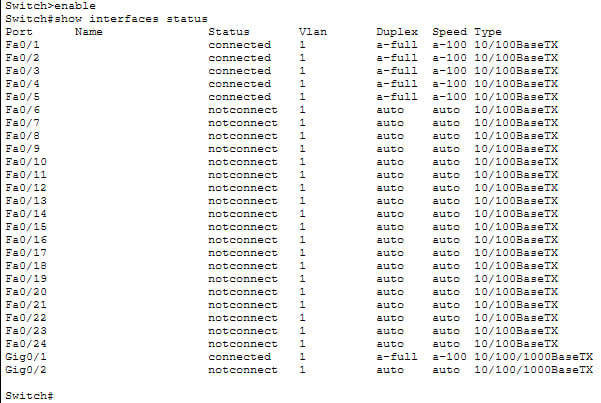
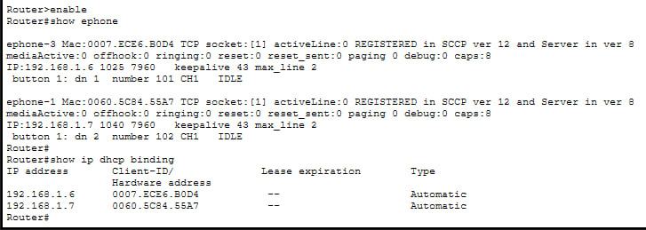
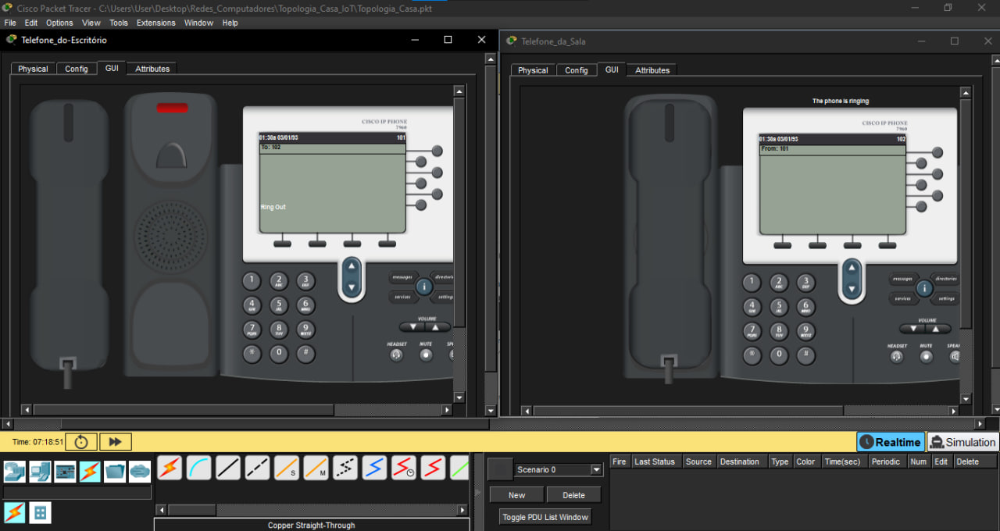
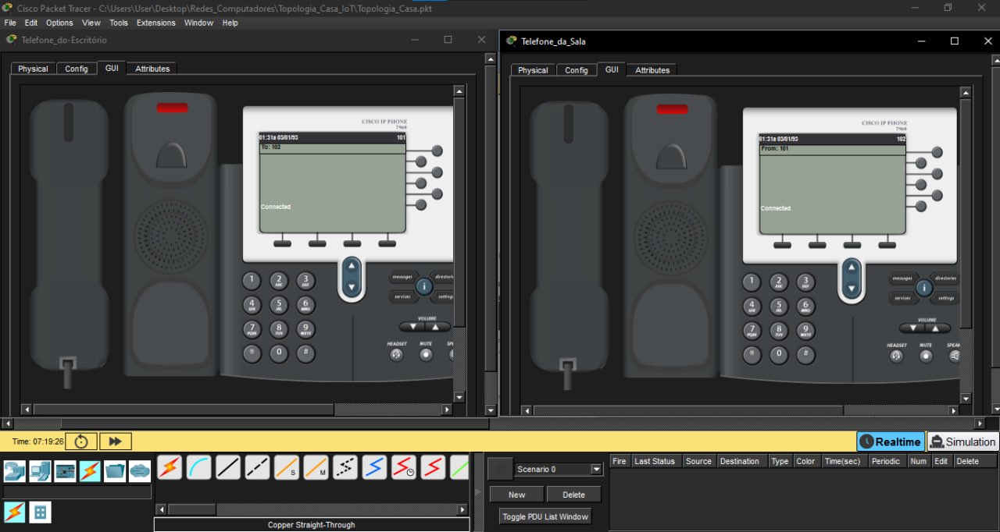

# 🏠 Smart-Home-IoT-Cisco-PT

Simulação de uma rede residencial inteligente com telefonia IP e dispositivos IoT, montada no Cisco Packet Tracer.

---

## 📋 Sobre o projeto

A ideia foi simular uma casa real do ponto de vista de rede — não só conectar computadores, mas montar uma infraestrutura completa com telefonia IP funcionando, dispositivos IoT controlados remotamente e tudo passando pelo mesmo roteador e switch.

O projeto foi feito como parte do meu portfólio prático de redes, usando o Cisco Packet Tracer como ambiente de simulação.

---

## 🛠️ Ferramentas utilizadas

- Cisco Packet Tracer
- Roteador Cisco 2901
- Switch Cisco Catalyst 2960-24TT
- Cisco IP Phone 7960
- Dispositivos IoT (lâmpadas, câmeras, porta de garagem)
- Tablet para controle IoT
- Notebooks e PCs

---

## 🏗️ O que foi montado

A topologia representa uma casa com os seguintes cômodos: Quarto 1, Quarto 2, Sala, Cozinha, Escritório Home Office e Garagem.

Cada cômodo tem dispositivos conectados à rede, seja por cabo ou wireless. Toda a comunicação passa pelo switch, que está conectado ao roteador. O roteador é o coração da rede — ele distribui os IPs via DHCP, gerencia a telefonia IP e serve como gateway pra todos os dispositivos.

A topologia também conta com um **Server-PT** simulando um servidor DNS externo com o domínio `ns.casa.com.br`. Ao invés de depender de um DNS público como o 8.8.8.8 do Google, foi configurado um servidor próprio — o que representa um cenário mais próximo de ambientes reais onde a resolução de nomes é controlada internamente.

---

## 🔧 Configurações aplicadas

### Roteador (Cisco 2901)

O roteador foi configurado com o endereço `192.168.1.1` na interface GigabitEthernet0/0, que é a interface voltada pra rede da casa.

Foi criado um pool de DHCP chamado `REDE_DA_CASA` pra distribuir IPs automaticamente pra todos os dispositivos. Os endereços de `.1` até `.5` foram reservados para uso fixo, então os dispositivos recebem a partir do `.6`.

Uma configuração importante foi a **option 150**, que aponta os telefones IP pro próprio roteador como servidor TFTP. Sem essa linha, os telefones não conseguem se registrar no serviço de telefonia.

O serviço de telefonia foi configurado com suporte a até 10 ramais e 10 telefones. Foram criados dois ramais:
- Ramal **101** — Telefone do Escritório
- Ramal **102** — Telefone da Sala

### Switch (Catalyst 2960)

Todas as 24 portas FastEthernet foram configuradas como `access` com `voice vlan 1` e `spanning-tree portfast`. Isso garante que os telefones IP subam na rede mais rápido, sem esperar o tempo padrão do Spanning Tree.

---

## 📡 Dispositivos IoT

A infraestrutura IoT foi montada de forma separada e independente da rede principal da casa. Pra isso foi usado um **Home Gateway**, que funciona como o controlador central dos dispositivos IoT — ele tem o próprio SSID wireless e os dispositivos se conectam diretamente a ele, sem passar pelo roteador ou switch da rede principal.

Essa foi uma decisão intencional. Na vida real, é uma prática comum isolar a rede IoT da rede principal da casa por questões de segurança — dispositivos inteligentes têm uma superfície de ataque maior e, se comprometidos, não devem ter acesso direto à rede onde estão os computadores e dados importantes.

O tablet de controle acessa o painel do Home Gateway e gerencia todos os dispositivos a partir daí. O Server-PT presente na topologia representa a conexão com a internet externa, separado dessa estrutura.

Os dispositivos configurados foram:

- **Porta da Garagem** — abrir e fechar remotamente
- **Lâmpada do Quarto 01** — ligar, desligar e dimmerizar
- **Câmera da Garagem 01 e 02** — monitoramento com imagem em tempo real

---

## 📸 Evidências do funcionamento

### Topologia geral com IoT Monitor
A visão lógica da topologia mostra todos os dispositivos posicionados nos cômodos da casa, com o IoT Monitor aberto controlando os dispositivos em tempo real.

### Status das interfaces do switch
O comando `show interfaces status` confirma que as portas Fa0/1 até Fa0/4 e Gig0/1 estão conectadas, com duplex full e velocidade de 100Mbps.

### Telefones registrados e DHCP
O comando `show ephone` mostra os dois telefones registrados no servidor de telefonia com status `REGISTERED`. O `show ip dhcp binding` confirma que os IPs `192.168.1.6` e `192.168.1.7` foram atribuídos automaticamente via DHCP para os dois telefones.

### Chamada sendo iniciada
O telefone do ramal 101 discou para o ramal 102. A tela mostra `Ring Out` no telefone que ligou e `The phone is ringing` no telefone que está recebendo a chamada.

### Chamada conectada
Após alguns segundos, ambos os telefones exibem `Connected`, confirmando que a chamada foi estabelecida com sucesso entre os dois ramais.

---

## 📁 Arquivo da topologia

O arquivo `.pkt` com a topologia completa está disponível para download e pode ser aberto no Cisco Packet Tracer 8.x ou superior.

[📥 Download — Smart-Home-IoT-Cisco-PT.pkt](Smart-Home-IoT-Cisco-PT.pkt)

---

Configurar telefonia IP do zero num roteador Cisco é bem diferente de só plugar um telefone na tomada. A parte mais crítica foi entender o papel da `option 150` no DHCP — sem ela, o telefone recebe IP mas não consegue baixar a configuração do servidor e fica sem ramal.

Outro ponto foi o `portfast` no switch. Sem ele, os telefones demoram mais pra subir porque ficam esperando o Spanning Tree convergir. Com o portfast, a porta sobe imediatamente.

No lado do IoT, a decisão mais importante foi usar o Home Gateway como uma rede independente, sem ligação com o roteador ou switch principal. Isso reflete uma boa prática de segurança — manter os dispositivos IoT isolados da rede onde ficam os computadores e dados. O Home Gateway cuida sozinho da comunicação com os dispositivos, e o tablet acessa o painel de controle direto por ele.

---

## ⚠️ Sobre a cobertura da topologia

Essa simulação não tem a pretensão de cobrir tudo que uma casa poderia ter em termos de rede e IoT. Os dispositivos escolhidos — lâmpadas, câmeras e porta de garagem — foram selecionados pra demonstrar diferentes tipos de integração, mas numa casa real o uso de IoT varia muito dependendo da necessidade, do orçamento e do nível de automação desejado. O objetivo aqui foi montar uma base funcional e representativa, não esgotar todas as possibilidades.

---

## 🚀 Próximos projetos

Outros projetos serão postados em breve, com topologias diferentes e níveis de complexidade maiores.

---

## 👤 Autor: Bruno Zucker

Desenvolvido como parte de um portfólio prático de redes com foco em certificações Cisco.
